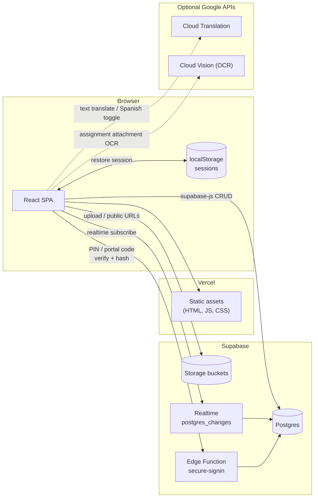

# Architecture & stack

Baseline architecture for the **pre-split monolith** (as of 08-06-2026). This describes how the app works **before** it is restructured and broken out of `src/App.jsx`. Expect this file to become historical once the refactor lands.

## Stack

| Layer      | Tech                                                                            |
| ---------- | ------------------------------------------------------------------------------- |
| UI         | React 18, Tailwind CSS, Lucide icons                                            |
| Routing    | Hash routes (`#/portal`, `#/staff`; also `#portal`, `#staff`) — no react-router |
| Build      | Vite                                                                            |
| Hosting    | Vercel (static deploy from GitHub)                                              |
| Backend    | Supabase — Postgres, Storage, Edge Functions                                    |
| Client SDK | `@supabase/supabase-js`                                                         |
| Auth       | Custom PIN / portal-code auth — **not** Supabase Auth                           |
| Optional   | Google Cloud Translation API, Google Cloud Vision API (OCR)                     |

## Request flow



## Repo layout

- **No server code in this repo.** Backend logic lives in Supabase (database, storage, Edge Functions).
- **The frontend talks to Supabase directly** via `@supabase/supabase-js`.
- **The entire app lives in `src/App.jsx`** (~60k lines). `src/main.jsx` mounts it; `src/index.css` holds global styles. No other source files yet.

Supabase URL, anon key, and the optional Google API key are hardcoded at the top of `src/App.jsx`. Deployment steps are in `README.md`.

> **Security note:** The Supabase anon key is expected in the client. The Google API key is also client-side — restrict it by HTTP referrer and API scope in Google Cloud Console.

## Auth & sessions

There is **no** `supabase.auth`. Sign-in is custom:

| Audience                        | Credential                                          | Edge function mode | Session storage                                                        |
| ------------------------------- | --------------------------------------------------- | ------------------ | ---------------------------------------------------------------------- |
| Staff (cleaners, leads, owners) | 4-digit PIN                                         | `mode: 'employee'` | `localStorage` key `tidytrack_session` → `{ employeeId }`              |
| Clients (PM portal)             | Portfolio access code (6+ chars, letters + numbers) | `mode: 'portal'`   | `localStorage` key `tidytrack_portal` → `{ userId, propertyId, code }` |

On load, staff re-fetch the `employees` row by stored ID; portal re-fetch `portal_users` by stored ID.

**Edge function `secure-signin`** (hosted in Supabase, not in this repo):

- `mode: 'employee'` — bcrypt-verify staff PIN → return employee row
- `mode: 'portal'` — bcrypt-verify portal access code → return portal user row
- `mode: 'set'` — hash a newly set PIN or portal code into `pin_hash` / `code_hash`

**Migration fallback:** If the edge function is unreachable, sign-in falls back to direct `employees` / `portal_users` queries. This keeps users from being locked out while RLS is being tightened; once table policies block anon reads, the fallback stops working for attackers.

## App structure (inside `App.jsx`)

### Entry & routing

```
App
├── #/portal (or #portal)  → PortalApp
├── #/staff  (or #staff)   → StaffApp
└── / (root)               → RootRouter
                              ├── LandingPage ("Summit Clean team" vs "Property manager")
                              └── StaffApp (if localStorage tt_role_choice === 'staff')
```

Staff and clients use **different routes and sign-in screens**, not a single combined form.

### Staff path (`StaffApp`)

1. `SignIn` — 4-digit PIN keypad
2. Shell selection (checked in this order):
   - **`BetaShell`** — if `is_beta_tester`; sticky toggle between beta / employee / PM preview views (bypasses normal role routing)
   - `ManagerShell` — `role: owner` or `manager` (owner / lead)
   - `EmployeeApp` — `role: employee` (cleaners)

Owners (inside `ManagerShell`) can **preview as cleaner** or **preview as PM** without signing out.

Per-employee **capabilities** (`can(employee, 'view_pay_info')`, etc.) gate features like pay/invoice visibility for leads.

### Client path (`PortalApp` at `#/portal`)

Portal access code → property picker → portal UI.

| Shell       | Who                        | `portal_users.kind` values         |
| ----------- | -------------------------- | ---------------------------------- |
| `PortalApp` | Property managers & owners | `pm`, `property_owner`, `pm_staff` |

> **Naming:** "Lead" in `mvp.md` = `manager` in code. Unrelated to client-side "Property Manager" (`pm` kind).

## Realtime

`useAssignmentSync` subscribes to `postgres_changes` on:

- `assignment_targets`, `assignments`, `work_blocks`, `work_block_participants`, `tasks`, `photos`

Messaging uses separate channels on `conversations` / `messages`.

## Optional Google APIs

Both use the same `GOOGLE_TRANSLATE_API_KEY` constant in `App.jsx`.

| Feature                           | Flag / gate                | Status                            |
| --------------------------------- | -------------------------- | --------------------------------- |
| Short-text "Translate" buttons    | `TEXT_TRANSLATION_ENABLED` | **On** (needs valid API key)      |
| Full-page Spanish DOM translation | `TRANSLATION_ENABLED`      | **Off**                           |
| PDF/image auto-translate pipeline | `TRANSLATION_ENABLED`      | **Off**                           |
| Assignment attachment OCR         | valid API key              | Used for OCR → optional translate |

## Supabase surface area

### Storage buckets

- `task-photos` — cleaner task / damage / before-after photos
- `assignments` — assignment file uploads
- `pm-uploads` — client portal uploads
- `messages` — message attachments

### Tables

Schema lives in Supabase; table names below are inferred from queries in `App.jsx`.

**People & access**

- `employees`, `portal_users`, `portal_user_properties`

**Property structure**

- `customers` (properties), `units`, `parties`

**Work tracking**

- `assignments`, `assignment_targets`, `assignment_assignees`
- `shifts`, `work_blocks`, `work_block_participants`
- `tasks`, `photos`
- `view_only_sessions` — cleaner view-only mode audit trail

**Portal extras**

- `pm_photos`, `recheck_requests`, `recheck_request_items`

**Money**

- `invoice_price_book`, `invoices`, `invoice_lines`
- `employee_pay_days`, `manual_charges`, `profit_line_reviews`

**Config & templates**

- `supply_checklist_items`, `supply_checklist_confirmations`
- `item_label_overrides`
- `section_template_sets`, `section_template_variants`, `section_template_items`

**Messaging & notifications**

- `conversations`, `conversation_participants`, `messages`, `notifications`

> Messaging is implemented in code but listed as out-of-scope polish in `mvp.md`.

### Data access pattern

There is no ORM or shared data layer — components call `supabase.from(...)` directly.
