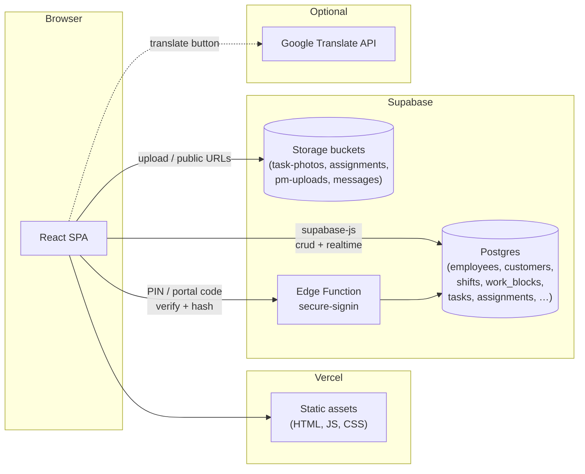

# Architecture & stack

Architecture and stack prior to 08-06-2026

## Stack

| Layer      | Tech                                          |
| ---------- | --------------------------------------------- |
| UI         | React 18, Tailwind CSS, Lucide icons          |
| Build      | Vite                                          |
| Hosting    | Vercel (static deploy from GitHub)            |
| Backend    | Supabase — Postgres, Storage, Edge Functions  |
| Client SDK | `@supabase/supabase-js`                       |
| Optional   | Google Cloud Translation API (Spanish toggle) |

## Request flow

## Current repo layout

This describes how the codebase is organized **today** — expect it to change as the app is split up.

- **No server code in this repo.** Backend logic lives in Supabase (database, storage, Edge Functions).
- **The frontend talks to Supabase directly** via `@supabase/supabase-js`.
- **The entire app currently lives in `src/App.jsx`** (~40k lines). `src/main.jsx` mounts it; `src/index.css` holds global styles. No other source files yet.

Supabase URL and anon key are at the top of `src/App.jsx`. Deployment steps are in `README.md`.

## App structure (today, inside `App.jsx`)

Sign-in splits **Internal staff** (PIN) from **Clients** (portal access code). After auth, one of three shells loads:

| Shell          | Who                        | Role in code                                            |
| -------------- | -------------------------- | ------------------------------------------------------- |
| `EmployeeApp`  | Cleaners                   | `role: employee`                                        |
| `ManagerShell` | Owner / Lead               | `role: owner` or `manager`                              |
| `PortalApp`    | Property managers & owners | `portal_users.kind`: `pm`, `property_owner`, `pm_staff` |

> **Naming:** "Lead" in `mvp.md` = `manager` in code. Unrelated to client-side "Property Manager".

## Supabase surface area

**Edge Function (hosted in Supabase, not in this repo)**

- `secure-signin` — bcrypt verify for staff PINs and portal codes; hashes credentials on set

**Storage buckets**

- `task-photos` — cleaner task / damage / before-after photos
- `assignments` — assignment file uploads
- `pm-uploads` — client portal uploads
- `messages` — message attachments

**Core tables** (schema lives in Supabase; inferred from queries in `App.jsx`)

- People: `employees`, `portal_users`, `portal_user_properties`
- Sites: `customers` (properties), units/subsections via property config
- Work: `assignments`, `assignment_targets`, `shifts`, `work_blocks`, `work_block_participants`, `tasks`, `photos`
- Money: `invoice_price_book`, invoice-related tables
- Config: `supply_checklist_items`, section templates, label overrides

There is no ORM or shared data layer — components call `supabase.from(...)` directly.
